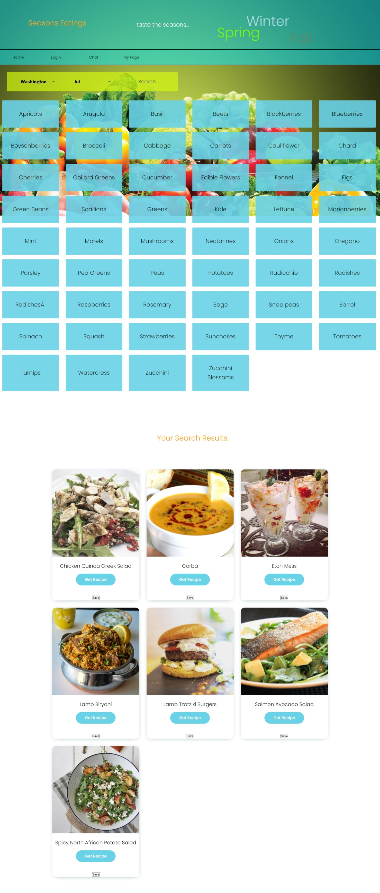

# project_2 - Seasons Eatings

#### Table of Contents
* [About](#about-this-project)
    * [Description](#description)
    * [Built With](#built-with)
* [Usage](#usage)
* [Contributors](#contributors)

# About this Project

## Description

Seasons Greetings is a fun and easy to use website that helps the user find key healthy ingredients that are in season in their state. After the user selects one of the products that they would like to use, we send them a selection of recipes that they can make using the in-season ingrediant. 

The user can then save their favorite ingrediants to their profile for easy access in the future. 

This is a full stack app that is hosted on heroku, using MYSQL, Express, Sequelize and Javascript along with some other npm packages to keep this site running. 

## Built With

* [Javascript](https://www.javascript.com/)
* [CSS](https://www.w3.org/Style/CSS/)
* [HTML5](https://html.com/html5/)
* [Node.js](https://nodejs.org/en/)
* [Sequelize](https://sequelize.org/)
* [Socket.io](https://socket.io/)
* [Express.js](https://expressjs.com/)
* [Bcrypt](https://www.npmjs.com/package/bcrypt)
* [Handlebars.js](https://handlebarsjs.com/)
* [MySQL2](https://www.npmjs.com/package/mysql2)
* [The Meal DB](https://www.themealDB.com/api.php)

# Usage

Click the link to our webpage: <https://quiet-lowlands-76523.herokuapp.com/>

# Contributors

* [Eric Malpass](https://github.com/EricMalpass)
* [Kelly Dean Mahaffey](https://github.com/DeanMahaffey)
* [ShaoGe](https://github.com/sg3606)
* [Samuel Oberg](https://github.com/sosoberg)
* [Sandra De La Torre](https://github.com/bootcamp874)